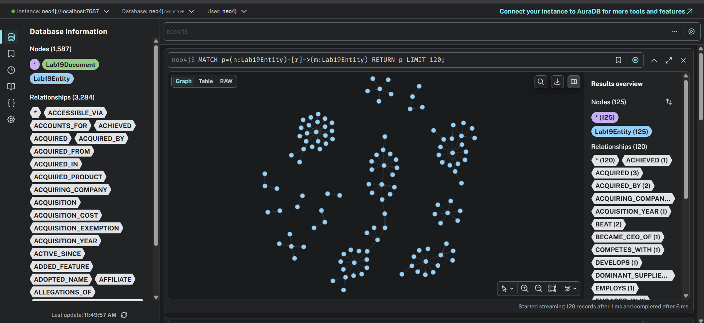

# Báo cáo Lab Day 19: GraphRAG với 100 bài Wikipedia về công ty AI

## Hồ Trọng Duy Quang - 2A202600081

## 1. Corpus

Corpus của bài lab gồm 100 bài Wikipedia về các công ty AI và các công ty công nghệ có liên quan đến AI. Dữ liệu được thu thập bằng script `scrape_wikipedia_ai_companies.py` thông qua Wikipedia MediaWiki API.

- File corpus: `data/wikipedia_ai_company_corpus.jsonl`
- File manifest nguồn dữ liệu: `data/wikipedia_ai_company_manifest.json`
- Số lượng bài viết: 100
- Nội dung mỗi bài: plain-text intro extract từ Wikipedia, có giới hạn độ dài để giảm chi phí token
- Một số bài tiêu biểu: OpenAI, Anthropic, Google DeepMind, Google, Microsoft, Meta Platforms, Nvidia, Apple, Amazon, IBM

Mỗi dòng trong corpus có dạng:

```json
{
  "id": "wiki_001_openai",
  "title": "OpenAI",
  "url": "https://en.wikipedia.org/wiki/OpenAI",
  "text": "..."
}
```

## 2. Trích xuất triples bằng LLM

Triples được trích xuất bằng OpenAI `gpt-4o-mini`. Mỗi bài Wikipedia được đưa vào LLM để chuyển thành các triples tri thức:

```text
(subject, relation, object)
```

Ví dụ:

```text
(OpenAI Global, LLC, DEVELOPED_PRODUCT, GPT family)
(Microsoft, INVESTED_IN, OpenAI Global, LLC)
(DeepMind, ACQUIRED_BY, Google)
```

Pipeline dùng structured JSON output để giảm lỗi JSON khi model trả lời. Kết quả triples cuối cùng được lưu tại:

- `outputs/triples.json`

Kết quả lần chạy hiện tại:

- Số triples trích xuất: 1591

## 3. Xây dựng graph bằng Neo4j

Knowledge graph được xây dựng bằng Neo4j. Mỗi thực thể được lưu thành node `Lab19Entity`, còn mỗi quan hệ được lưu thành edge giữa hai node.

Quy trình build graph:

1. Đọc triples do OpenAI trích xuất.
2. Khử trùng lặp triples.
3. Tạo node `Lab19Entity` trong Neo4j.
4. Tạo các quan hệ có type như `FOUNDED_BY`, `INVESTED_IN`, `CREATED`, `OWNS`, `DEVELOPS`.
5. Liên kết entity với document nguồn bằng quan hệ `MENTIONED_IN`.

Query dùng để visualization trong Neo4j Browser:

```cypher
MATCH p=(n:Lab19Entity)-[r]->(m:Lab19Entity)
RETURN p
LIMIT 120;
```

## 4. Cách query GraphRAG

GraphRAG sử dụng pipeline truy vấn như sau:

1. Nhận câu hỏi từ người dùng.
2. Trích xuất hoặc chọn entity chính trong câu hỏi.
3. Tìm node tương ứng trong Neo4j.
4. Duyệt graph trong phạm vi 2-hop.
5. Giới hạn graph context tối đa 50 cạnh.
6. Chuyển các cạnh graph thành textual context.
7. Gửi context và câu hỏi cho `gpt-4o-mini` để sinh câu trả lời cuối cùng.

Giới hạn cạnh được cấu hình trong code:

```python
MAX_GRAPH_CONTEXT_EDGES = 50
```

## 5. Hình minh họa graph

Visualization chính được lấy từ Neo4j Browser:



Ảnh backup được sinh bằng NetworkX và Matplotlib:


## 6. Chi phí và thời gian

Thống kê từ `outputs/token_usage.json`:

| Metric | Value |
|---|---:|
| Text input tokens | 233,348 |
| Text output tokens | 33,539 |
| Embedding tokens | 449,777 |
| Text calls | 160 |
| Embedding calls | 40 |
| Runtime | 921.465 seconds |
| Estimated cost | $0.064121 |

Số liệu này tương ứng với lần chạy full end-to-end, bao gồm cả bước trích triples từ 100 bài Wikipedia, build graph, tạo embeddings, chạy Flat RAG và chạy GraphRAG.

## 7. Thiết kế benchmark mới

Bộ benchmark gồm 20 câu hỏi dạng multi-hop/graph-shaped. Mỗi câu bắt đầu từ một entity cụ thể và yêu cầu tổng hợp nhiều quan hệ xung quanh entity đó.

Ví dụ:

```text
Starting from OpenAI Global, LLC, which company invested in it,
what investment amount is connected, and which AI products did it develop?
```

Thiết kế này phù hợp hơn để đánh giá GraphRAG vì GraphRAG có thể duyệt các cạnh 2-hop trong Neo4j và gom nhiều facts đã được LLM trích thành graph.

## 8. Tóm tắt so sánh Flat RAG và GraphRAG

Sau khi đổi benchmark sang các câu hỏi multi-hop dựa trên quan hệ trong graph, GraphRAG cải thiện rõ rệt so với lần benchmark trước. GraphRAG trả lời tốt ở nhiều câu vì các thông tin cần thiết đã nằm trong graph context.

Tuy nhiên, GraphRAG chưa thắng tuyệt đối Flat RAG. Flat RAG vẫn tốt hơn ở các câu cần thông tin mô tả rộng hoặc facts chưa được trích thành edge trong graph. Nhìn chung:

- GraphRAG tốt hơn hoặc đáng tin hơn: 7 câu
- Flat RAG tốt hơn: 5 câu
- Gần như hòa hoặc mỗi hệ thống có ưu điểm riêng: 8 câu

### Các trường hợp GraphRAG tốt hơn hoặc đáng tin hơn

| # | Câu hỏi | Nhận xét |
|---:|---|---|
| 1 | OpenAI Global, LLC: investor, amount, products | GraphRAG trả lời đúng và gọn: Microsoft, $13B, DALL-E, GPT, Sora. |
| 2 | Anthropic: founders, product, AI focus | GraphRAG trả lời đúng Daniela/Dario Amodei, Claude, AI safety; ít dư thừa hơn Flat RAG. |
| 3 | DeepMind: acquired by, rebranded as, AlphaFold | GraphRAG trả lời đúng và ngắn gọn theo các cạnh trong graph. |
| 5 | Meta Platforms: owned apps, Big Tech competitors | GraphRAG tránh hallucination; Flat RAG thêm “Manus” và Nvidia không chắc chắn. |
| 9 | Apple: founders, CEOs, products | GraphRAG trả lời theo graph hiện có: Steve Jobs, Tim Cook, AirPods, Apple Watch, Mac, iPad, iPhone. Flat RAG thêm thông tin tương lai rủi ro. |
| 14 | Palantir: founders, Gotham, clients | GraphRAG tốt hơn vì gom được founders, Palantir Gotham và nhiều clients từ graph. |
| 15 | Databricks: developed items, founder source, year, platform | GraphRAG nêu rõ Delta Lake, data lakehouse architecture, creators of Apache Spark, 2013, data analytics and AI platform. |

### Các trường hợp Flat RAG tốt hơn

| # | Câu hỏi | Nhận xét |
|---:|---|---|
| 4 | Google DeepMind: products and relation to DeepMind/Google | Flat RAG đầy đủ hơn nhiều, liệt kê AlphaGo, AlphaFold, Gemini, Imagen, Veo, Lyria và lịch sử merge. |
| 8 | TSMC: founder, headquarters, customers | Flat RAG trả lời nhiều customers hơn, gồm Nvidia, Apple, Broadcom, Qualcomm. GraphRAG chỉ nêu AMD, ARM, Marvell, MediaTek. |
| 10 | Amazon.com, Inc.: founder, location, products/services | Flat RAG có mô tả rộng hơn về AWS, streaming, advertising, AI services. |
| 12 | Zoox: owner, product/service, headquarters | Flat RAG có ý “mobility as a service”, GraphRAG thiếu phần này. |
| 19 | Arm Holdings: Nvidia takeover and GPU competitors | Flat RAG trả lời takeover/collapse tốt hơn; GraphRAG sai hoặc thiếu competitors do entity selection/context chỉ có 1 cạnh. |

### Các trường hợp gần như hòa hoặc mỗi hệ thống có ưu điểm riêng

| # | Câu hỏi | Nhận xét |
|---:|---|---|
| 6 | Microsoft Corporation | Cả hai trả lời đúng founders, headquarters và acquisitions; Flat RAG có thêm năm acquisition. |
| 7 | Nvidia Corporation | Cả hai trả lời đúng founders, technologies và 80% AI GPU market share. |
| 11 | Waymo | Cả hai trả lời tốt về Google, co-CEOs, funding và valuation. |
| 13 | Snowflake Inc. | Cả hai trả lời đúng cloud platforms và platform type. |
| 16 | ServiceNow, Inc. | Cả hai trả lời đúng founder, workflow/cloud platform, listing/location. |
| 17 | UiPath Inc. | Cả hai trả lời đúng founder, AI/automation capabilities và public date; Flat RAG chi tiết hơn. |
| 18 | Cerebras Systems Inc. | Cả hai trả lời đúng AI systems/chips và office locations. |
| 20 | Element AI | Cả hai trả lời được ServiceNow acquisition; Flat RAG diễn đạt rõ hơn một chút. |

## 9. Bảng benchmark đầy đủ

| # | Question | Flat RAG | GraphRAG | Notes |
|---:|---|---|---|---|
| 1 | Starting from OpenAI Global, LLC, which company invested in it, what investment amount is connected, and which AI products did it develop? | Microsoft invested over $13 billion in OpenAI Global, LLC. OpenAI developed the generative pre-trained transformer (GPT) family of large language models, the DALL-E series of text-to-image models, and the Sora series of text-to-video models. | Microsoft invested in OpenAI Global, LLC with an investment amount of $13 billion. The AI products developed by OpenAI Global, LLC include the DALL-E series, GPT family, and Sora series. | GraphRAG tốt hơn |
| 2 | Starting from Anthropic, who founded it, what product does it develop, and what AI focus is connected to the company? | Anthropic was founded by former OpenAI members Daniela Amodei and Dario Amodei. The company develops large language models (LLMs) named Claude and focuses on AI safety. | Anthropic was founded by Daniela Amodei and Dario Amodei. It develops Claude, a large language model, and focuses on AI safety. | GraphRAG tốt hơn |
| 3 | Starting from DeepMind, which company acquired it, what was it rebranded as, and which system did it introduce in 2020? | DeepMind was acquired by Google. It was rebranded as Google DeepMind in April 2023. In 2020, it introduced AlphaFold, which made significant advances in protein folding prediction. | DeepMind was acquired by Google, rebranded as Google DeepMind, and introduced AlphaFold in 2020. | GraphRAG tốt hơn |
| 4 | Starting from Google DeepMind, which products did it develop, and how is it connected back to DeepMind and Google? | Google DeepMind developed AlphaGo, AlphaZero, MuZero, AlphaStar, AlphaFold, Gemini, Imagen, Veo, Lyria and other systems. It connects to DeepMind through Google's acquisition and later merger with Google Brain. | Google DeepMind developed Gemini, Imagen, and Veo. It is connected to Google LLC and Alphabet Inc. | Flat RAG tốt hơn |
| 5 | Starting from Meta Platforms, Inc., which apps does it own and which Big Tech companies does it compete with? | Meta owns Facebook, Instagram, WhatsApp, Messenger, Threads, and also mentions Manus; it competes with Alphabet, Amazon, Apple, Microsoft, and Nvidia. | Meta owns Facebook, Instagram, Messenger, Threads, and WhatsApp. It competes with Alphabet, Amazon, Apple, and Microsoft. | GraphRAG tốt hơn |
| 6 | Starting from Microsoft Corporation, who founded it, where is it headquartered, and which acquisitions are connected to it? | Microsoft was founded by Bill Gates and Paul Allen, headquartered in Redmond, and connected to Skype, LinkedIn, and Activision Blizzard acquisitions. | Microsoft was founded by Bill Gates and Paul Allen, headquartered in Redmond, and connected to Activision Blizzard, LinkedIn, and Skype Technologies. | Hòa |
| 7 | Starting from Nvidia Corporation, who founded it, what technologies does it develop, and what AI GPU market share is linked to it? | Flat RAG correctly gives founders, GPUs, SoCs, APIs, and over 80% AI GPU market share. | GraphRAG gives founders, APIs, GPUs, SoCs, and 80% AI GPU market share in 2025. | Hòa |
| 8 | Starting from TSMC, who founded it, where is it headquartered, and which customers are connected to it? | Flat RAG gives Morris Chang, Hsinchu Science Park, and many customers including Nvidia and Apple. | GraphRAG gives Morris Chang, Taiwan, and customers AMD, ARM, Marvell, MediaTek. | Flat RAG tốt hơn |
| 9 | Starting from Apple Inc., who founded it, who are its CEOs in the graph, and which products are connected to it? | Flat RAG gives founders and products but adds future CEO information. | GraphRAG gives founders, Steve Jobs and Tim Cook, plus AirPods, Apple Watch, Mac, iPad, iPhone. | GraphRAG tốt hơn |
| 10 | Starting from Amazon.com, Inc., who founded it, when was it founded, where is it located, and which products or services are connected? | Flat RAG gives Jeff Bezos, 1994, Bellevue, and broad services including AWS, streaming, advertising, AI services. | GraphRAG gives Jeff Bezos, 1994, Bellevue, Echo, Fire TV, Fire tablets, Kindle, Amazon Prime. | Flat RAG tốt hơn |
| 11 | Starting from Waymo, how is it related to Google, who runs it, and what funding or valuation facts are connected? | Flat RAG gives Alphabet/Google relation, spin-out, co-CEOs, $11B, $16B, $126B valuation. | GraphRAG gives Google LLC relation, Google spin-out, co-CEOs, $11B, $16B, $126B valuation. | Hòa |
| 12 | Starting from Zoox, which company owns it, what does it develop or provide, and where is it headquartered? | Flat RAG gives Amazon, driverless vehicles, mobility as a service, Foster City. | GraphRAG gives Amazon.com, self-driving vehicle technology, Foster City. | Flat RAG tốt hơn |
| 13 | Starting from Snowflake Inc., which cloud platforms does it operate on, and what kind of platform is it? | Flat RAG gives AWS, Microsoft Azure, Google Cloud Platform, cloud-based data platform. | GraphRAG gives AWS, Google Cloud Platform, Microsoft Azure, cloud-based data platform. | Hòa |
| 14 | Starting from Palantir Technologies Inc., who founded it, what product is used by US government organizations, and which clients are connected? | Flat RAG gives founders and Palantir Gotham used by US government organizations. | GraphRAG gives founders, Palantir Gotham, and clients Airbus, Fiat Chrysler Automobiles, Lilium, Merck KGaA, Morgan Stanley, PG&E, Wejo. | GraphRAG tốt hơn |
| 15 | Starting from Databricks, Inc., what did it develop, who founded it, when was it founded, and what platform does it offer? | Flat RAG says it was developed by Apache Spark creators, founded in 2013, and offers data analytics/AI platform. | GraphRAG adds Delta Lake and data lakehouse architecture, Apache Spark creators, 2013, and data analytics/AI platform. | GraphRAG tốt hơn |
| 16 | Starting from ServiceNow, Inc., who founded it, what does it provide or supply, and where is it listed or located? | Flat RAG gives Fred Luddy, cloud workflow platform, NYSE, Santa Clara. | GraphRAG gives Fred Luddy, automated business workflows, cloud computing platform, NYSE, Santa Clara. | Hòa |
| 17 | Starting from UiPath Inc., who founded it, what AI or automation capabilities does it develop or enable, and when did it become public? | Flat RAG gives founders, AI/agentic automation, workflow automation, April 21 2021. | GraphRAG gives founders, AI agents, automation of complex processes/workflows, April 21 2021. | Hòa |
| 18 | Starting from Cerebras Systems Inc., what does it build or develop, and which office locations are connected? | Flat RAG gives AI deep learning systems, wafer-scale AI chips, Sunnyvale, San Diego, Toronto, Bangalore. | GraphRAG gives the same core facts more compactly. | Hòa |
| 19 | Starting from Arm Holdings, which company announced a takeover deal, when did that deal collapse, and which GPU competitors are connected? | Flat RAG gives Nvidia, 2020, February 2022, and competitors Qualcomm, Samsung, Nvidia. | GraphRAG gives Nvidia and February 2022 but wrong/incomplete competitors AMD and Intel. | Flat RAG tốt hơn |
| 20 | Starting from Element AI, which company acquired it, and what business workflow or cloud platform facts are connected through that acquirer? | Flat RAG gives ServiceNow and cloud-based workflow automation platform. | GraphRAG gives ServiceNow and cloud-based digital workflow platform but says context lacks specific facts. | Hòa |

## 10. Nhận xét

Kết quả cho thấy GraphRAG phù hợp hơn khi câu hỏi được thiết kế để khai thác cấu trúc graph. Với các câu hỏi bắt đầu từ một entity cụ thể và yêu cầu gom nhiều relation, GraphRAG có thể tổng hợp facts từ nhiều cạnh trong Neo4j một cách gọn và ít nhiễu.

Flat RAG vẫn có lợi thế khi câu trả lời cần nhiều mô tả tự nhiên, hoặc khi graph extraction bỏ sót một số cạnh quan trọng. Vì vậy, hai phương pháp bổ sung cho nhau:

- Flat RAG mạnh về truy xuất đoạn văn giàu ngữ cảnh.
- GraphRAG mạnh về tổng hợp quan hệ rõ ràng giữa các thực thể.

Để cải thiện tiếp, có thể kết hợp hai hướng: dùng GraphRAG để lấy các entity/relation trọng tâm, sau đó dùng Flat RAG để bổ sung đoạn văn giải thích chi tiết.
